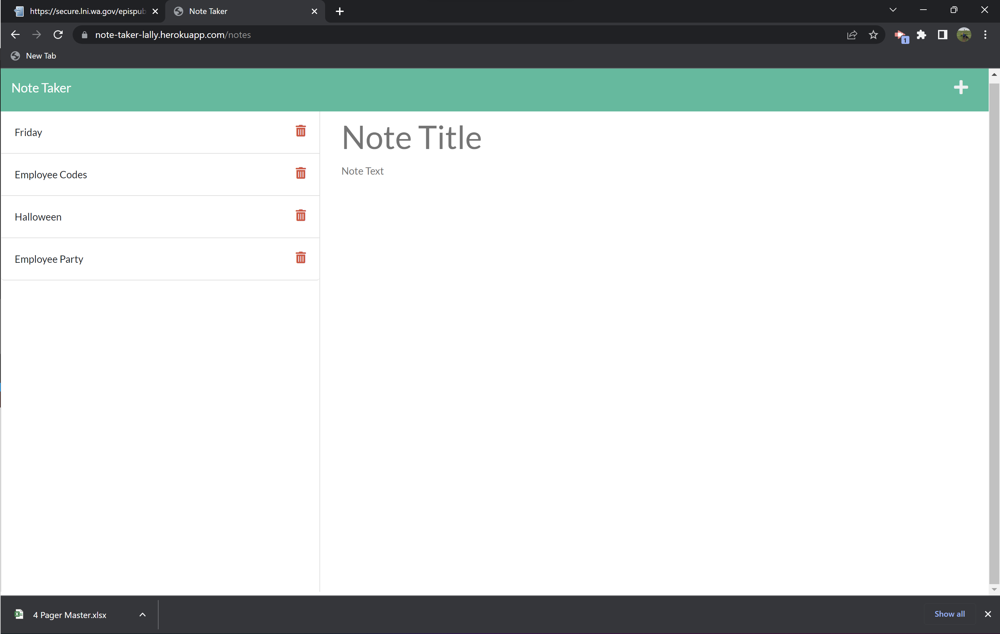
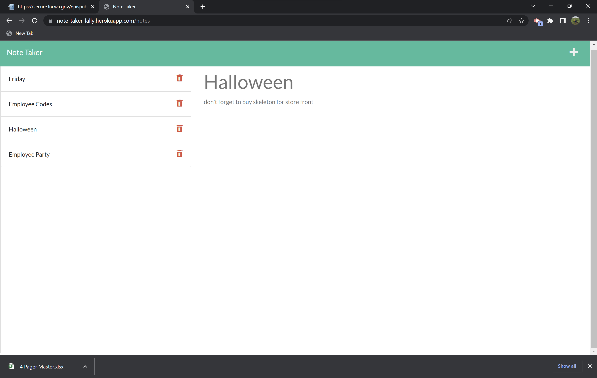
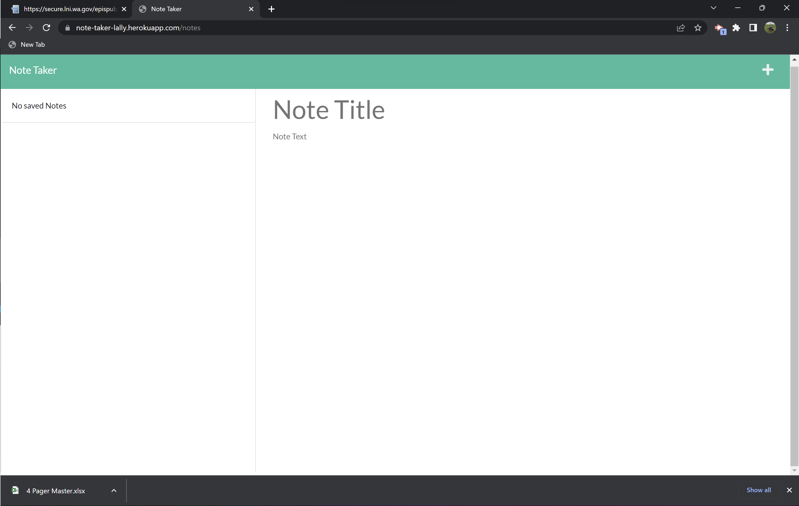

# The Note Taker
An application for writing and saving notes

## Description

Business owners lead busy and demanding lives.  They have so many things to keep track of: employees, clients, inventory, events, etc. The list never ends.  This application was built to provide another tool for the business owner on the go.  Someone who might need an easy to use Note Taker to keep track of ideas, inspiration, or daily, weekly, and monthly tasks. 

Creating the Note Taker was my first introduction into backend development.  I learned how to create routes in order to get, post, and delete stored data.  I learned how to use Insomnia to assist with writing and testing these routes.  I learned how to push applications to Heroku and deploy my site. 

## Technology

This application was created with an Express.js back end.  Deployed with Heroku.

## Usage

The Note Taker application is viewable and usable at: https://note-taker-lally.herokuapp.com

Users may add a note by clicking the Plus icon, typing in a Note Title and Note Text, and clicking the Save icon.  Notes will be saved in the left side column.  To view a saved note, click on the note of interest.  It will display in the main window.  To delete a note, click the Trash icon next to the note.

## Credits

Huge thanks to my instructional team and cohort.

## License

MIT License

Copyright (c) 2022 rachlally